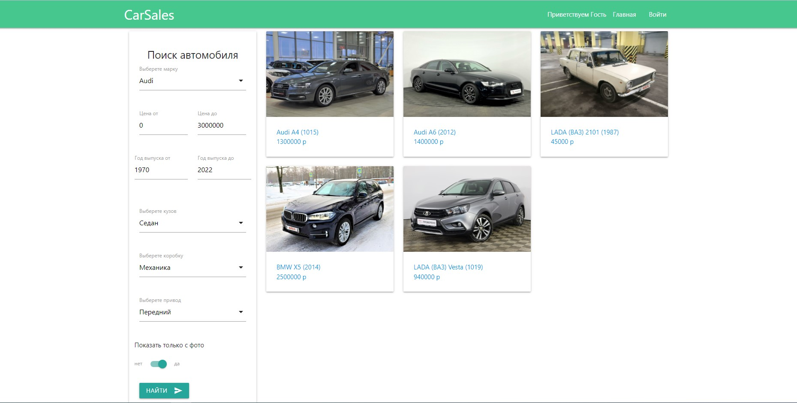
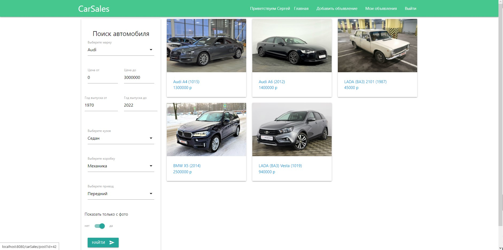
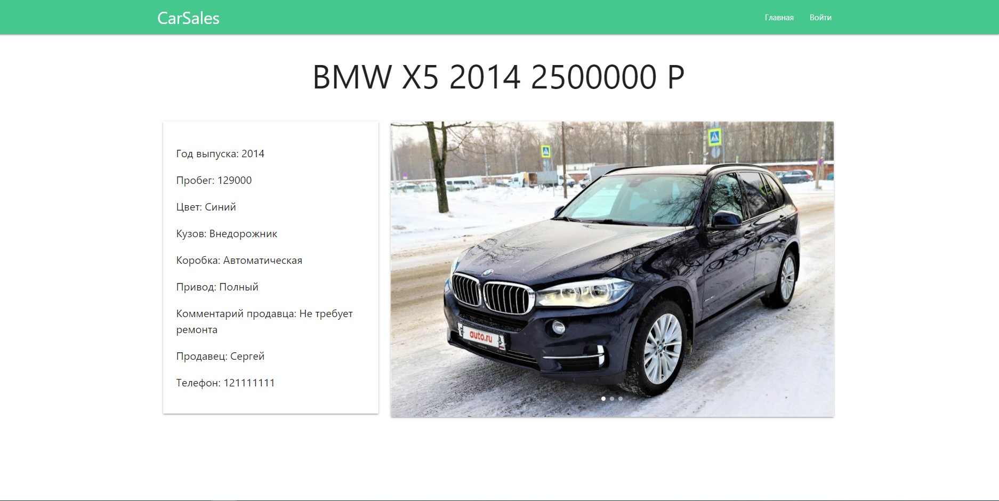
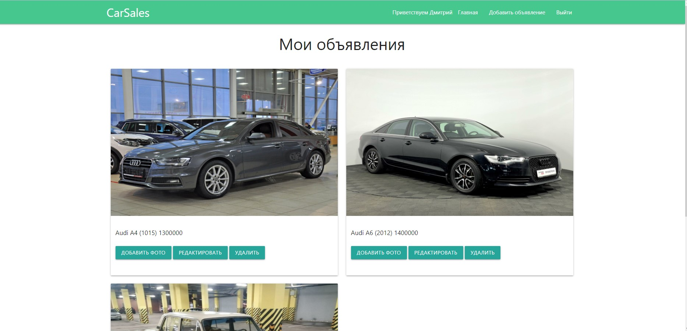
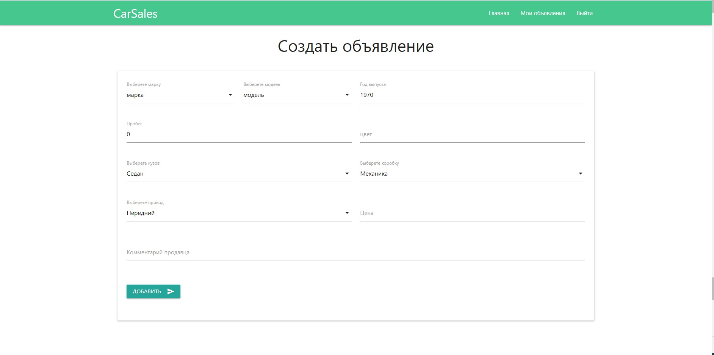
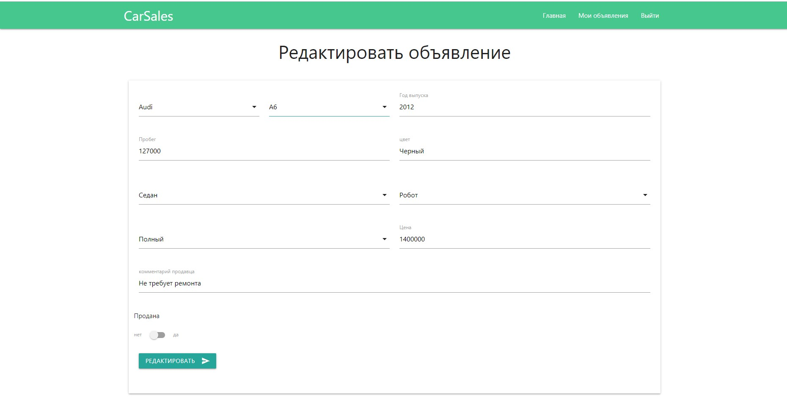
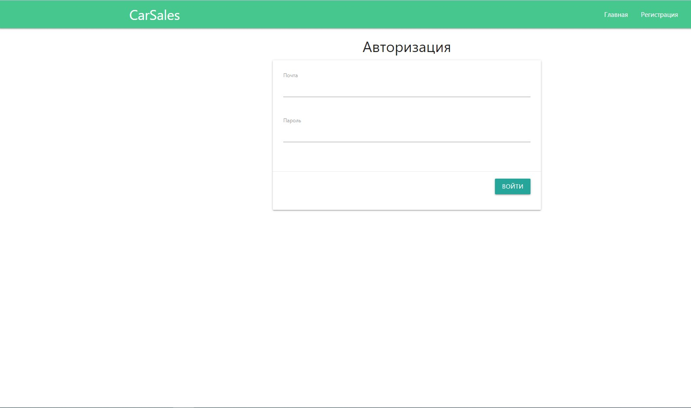
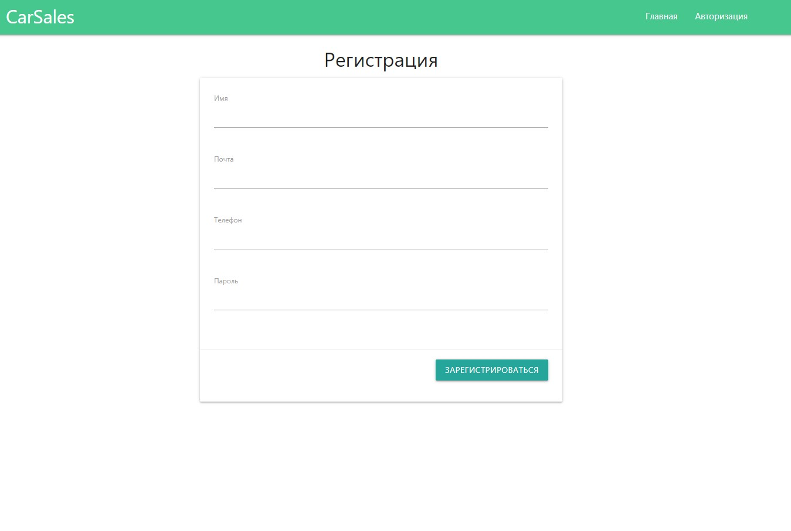

# CarSales

## Описание
Это приложение - площадка для продажи машин. Каждый зарегистрированный пользователь 
может добавлять объявления, менять их статус и удалять, на главной странице собраны 
все объявления с возможностью подробно ознакомиться с ними. Незарегистрированные пользователи могут 
только просматривать объявления. 

### Технологии 
+ Java 15
+ Java EE Servlets
+ PostgreSQL, Hibernate
+ Maven, Tomcat
+ HTML, JavaScript, jQuery, JSON

### Главная страница
На главной странице собраны все активные объявления, а также меню поиска по 
определенным параметрам
 

Для зарегистрированных пользователей становятся доступными дополнительные меню: 
создать объявление и мои объявления. которые позволяют создавать, редактировать 
и удалять объявления, а так же добавлять фото.

### Страница подробной информации о машине
Здесь можно подробнее изучить параметры автомобиля, а также увидеть контакты продавца

### Страница со всеми объявлениями пользователя
Здесь можно добавлять фото, редактировать объявление и удалять его 

### Страница создания нового объявления

Здесь можно создавать новое объявление

### Страница редактирования
Здесь можно редактировать объявление, а также менять его 
статус продано или нет

### Страница авторизации

### Страница регистрации

